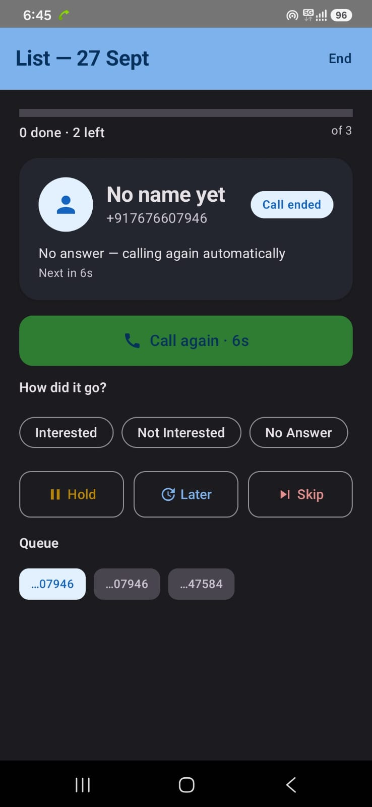
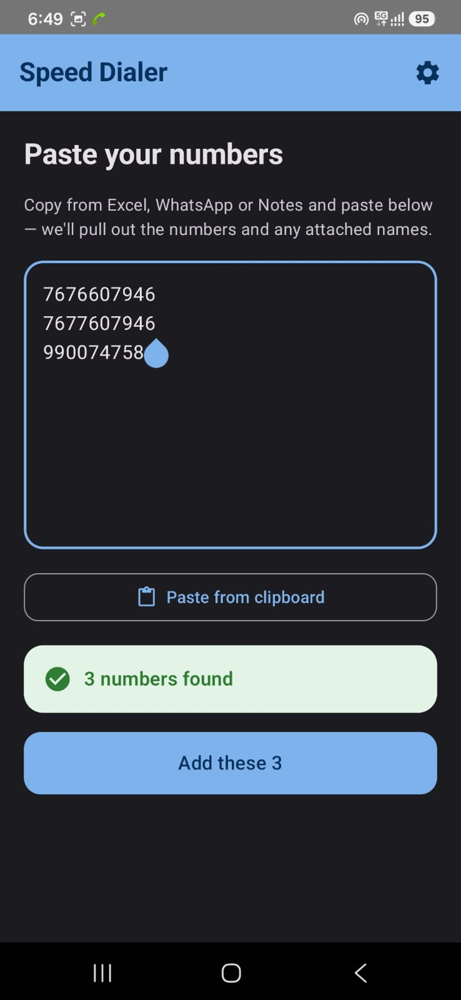
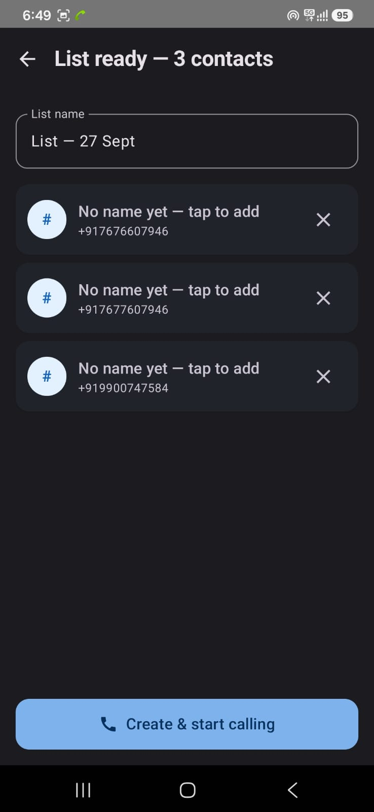
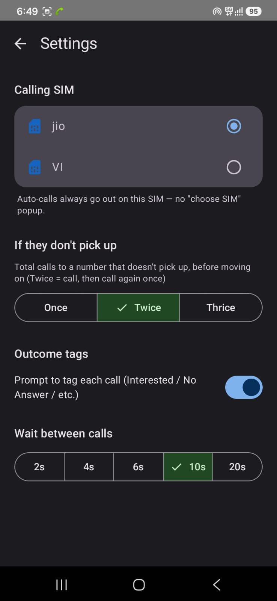
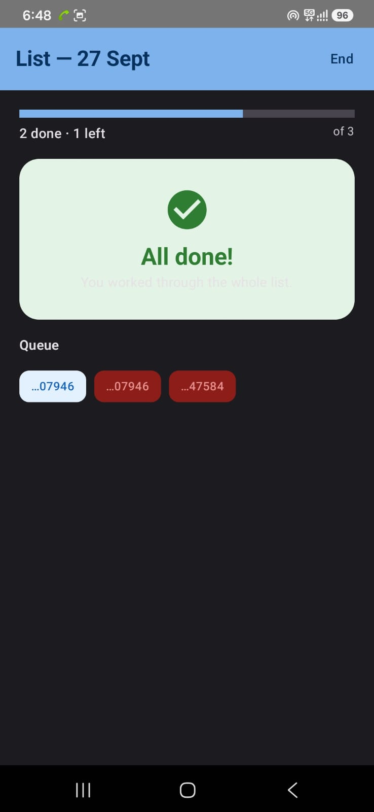

# Speed Dialer

An Android app that turns a column of phone numbers from Google Sheets into a hands-free calling queue. Paste the numbers, tap once, and it calls them one after another, redialing the ones that don't pick up.

Built for our inside sales team.

<p align="center">
  
</p>

---

## 1. How the team dials today

Our leads live in Google Sheets. Each row is a lead, with a phone number in one column and usually a name and some notes beside it. A rep opens the sheet and works down the list, calling every lead one by one.

For every single lead, the rep does this by hand:

1. Find the next row in the sheet.
2. Copy the number.
3. Switch to the phone app and paste or type it.
4. Choose the right SIM, if the phone has two.
5. Press call, then talk or wait for it to ring out.
6. Hang up, switch back to the sheet, find the place again, and start over.

Numbers also arrive in different shapes: with and without `+91`, with spaces, with a name attached, or pasted from WhatsApp or Notes. Cleaning those up is one more manual step.

## 2. Why that's a problem

The work that earns money is the conversation. Everything around it is overhead, and with manual dialing that overhead is repeated for every lead, every day.

- **Time.** Copying, switching apps, dialing and finding the place in the sheet happens on every call. Over a full day of dialing, that is a large share of the shift spent on things that aren't selling. That time is better spent talking to leads and following up.
- **Mistakes.** Numbers get mistyped, rows get skipped, and the same lead can be called twice by accident.
- **Uneven follow-up.** Whether a lead who didn't pick up got a second attempt depended on the rep remembering to try again.
- **Lost momentum.** Every pause between calls breaks the rhythm of a calling session.

## 3. What we built

Speed Dialer does the dialing so the rep only handles the conversation. The only input it needs is the phone numbers.

1. **Paste the numbers.** Copy the phone number column from Google Sheets and paste it in. The app finds every number, and any name written beside it, whatever format it's in.
2. **Check the list.** Duplicates are dropped automatically. Names can be added or fixed, and numbers removed, before dialing starts.
3. **Start.** The app places each call itself, on the SIM you chose, with no dialer screen to tap through.
4. **Keep going.** When a call ends, a short countdown starts. If the call went unanswered and redials are left, the app calls the number again on its own. Otherwise it moves to the next lead. The rep can override either at any moment.

<table>
  <tr>
    <td align="center" width="33%"><br><b>1. Paste</b><br>Drop in raw numbers from the sheet. The count of numbers found updates as you type.</td>
    <td align="center" width="33%"><br><b>2. Review</b><br>Duplicates already removed. Add names, remove entries, name the list.</td>
    <td align="center" width="33%"><br><b>3. Dial</b><br>Live progress, the current lead, and the post-call countdown with a <b>Call again</b> button.</td>
  </tr>
  <tr>
    <td align="center" width="33%"><br><b>Settings</b><br>Calling SIM, how many times to try a number, outcome tags, and the wait between calls.</td>
    <td align="center" width="33%"><br><b>Done</b><br>When the queue is empty you get a clear finish, with the status of every number below.</td>
    <td></td>
  </tr>
</table>

## 4. Features that support the process

**Getting the numbers in**
- **Flexible input.** Handles `9876543210`, `+91 98765 43210`, `919876543210`, `Rahul: 98765 43210`, several numbers on one line, and text pasted straight from a sheet, chat or note. Ten-digit numbers are treated as Indian (`+91`) by default.
- **Names picked up automatically.** If a name sits next to a number, it comes along and shows on the dialing screen.
- **Duplicate removal.** The same number appearing twice is called once.
- **Review before dialing.** Fix names, remove entries and name the list first.

**Dialing**
- **Back-to-back auto-dialing.** Calls go out one after another. The app notices when each call ends and moves on by itself.
- **Fixed calling SIM.** Pick a SIM once in Settings. Calls always go out on it, with no "choose SIM" popup interrupting the session.
- **Adjustable wait between calls.** 2, 4, 6, 10 or 20 seconds.
- **Keeps running during calls.** The queue runs in a foreground service, so it isn't lost when the phone's call screen takes over.

**Unanswered calls**
- **Automatic double dialing.** Choose **Once**, **Twice** or **Thrice**: the total number of calls made to a number that doesn't pick up. With **Twice**, an unanswered number is called, then called once more, then the queue moves on.
- **Call again button.** After every call a countdown runs. Tap **Call again** to redial immediately, or let it run out.

**Staying in control**
- **Hold** pauses the whole session until you resume.
- **Later** sends the current lead to the back of the queue.
- **Skip** drops the lead and moves on.
- **Outcome tags.** Optionally tag each call (Interested, Not Interested, No Answer, Busy, Callback Later, Wrong Number) with one tap, which also moves to the next lead straight away.
- **Live progress.** A progress bar, a done and left count, and a colour-coded queue strip show where you are in the list.

## How the "no answer" detection works

Android doesn't tell an app the moment the other person answers. So the app combines two signals it can rely on:

- **Call state.** It watches for the phone going from in-call back to idle. That is how it knows a call has ended.
- **Call log.** Right after the call ends, it looks up the call log entry for that number and reads the duration. A duration of `0` means the call never connected.

If the log says the call didn't connect and the number still has calls left, the countdown ends with an automatic redial. If the log shows a connected call, or the result can't be read, the countdown ends by moving to the next lead. The status line under the contact always says which of these it found, and the **Call again** button works whatever the result.

## Privacy

Everything stays on the phone.

- No account, no server, no analytics.
- Call lists live in memory only. Closing the app clears them. Only your settings (SIM, retry count, wait time) are saved.
- The app only ever dials numbers you paste in.

## Permissions

| Permission | Why it's needed |
|---|---|
| Phone (`CALL_PHONE`) | Place calls without tapping a dialer's call button each time. |
| Phone state (`READ_PHONE_STATE`, `READ_PHONE_NUMBERS`) | Detect when a call ends, and list the SIMs so you can choose one. |
| Call log (`READ_CALL_LOG`) | Check whether a call actually connected, so unanswered calls can be redialed. |
| Notifications (`POST_NOTIFICATIONS`) | Show the ongoing notification Android requires while a session runs. |
| Ignore battery optimizations | Stop the phone's battery manager from shutting the app down when a call starts. Some manufacturers, Samsung in particular, do this aggressively. |

The app asks for these on first launch and explains each one on screen.

## Installing

### Get the app onto a phone

1. Build an APK (see below).
2. Copy `app-debug.apk` to the phone: USB file transfer, cloud drive, or a chat message to yourself all work.
3. Open the file on the phone. When Android says installs from that source are blocked, choose **Settings** and allow it for the app you opened the file from.
4. Tap **Install**.

### First run

1. Grant the permissions when asked, then tap **Allow to run in background**.
2. Open **Settings** (gear icon on the paste screen) and pick your calling SIM.
3. Choose how many times to try an unanswered number, whether you want outcome tags, and the wait between calls.
4. Paste a list and start.

## Building from source

Requirements: JDK 17, the Android SDK (platform 34, build-tools 34.0.0), and Gradle 8.7. Android Studio bundles all of these.

**With Android Studio:** open this folder, let Gradle sync, connect a phone with USB debugging on, and press Run.

**From the command line:**

```bash
# in the project root, with JAVA_HOME pointing at JDK 17
# and sdk.dir set in local.properties
gradle assembleDebug
```

The APK is written to `app/build/outputs/apk/debug/app-debug.apk`. It is signed with the standard debug key, which is fine for installing on your own devices. Installing a newer build over an older one keeps your settings.

## Tech stack

- Kotlin and Jetpack Compose (Material 3)
- A bound foreground service that owns the queue and the dialing loop
- `TelecomManager.placeCall` for calling on a specific SIM
- `TelephonyCallback` (and `PhoneStateListener` on older Android) for call state
- Jetpack DataStore for settings
- Minimum Android 8.0 (API 26), targets Android 14 (API 34)

## Project layout

```
app/src/main/java/com/naveen/callqueue/
  data/       number parsing, queue entry model, saved settings
  telecom/    placing calls, listing SIMs, reading call results
  service/    the foreground service and the dialing loop
  ui/         Compose screens: paste, review, dialing, settings, permissions
  MainActivity.kt        navigation, permission requests, service binding
  AutoDialViewModel.kt
docs/screenshots/        images used in this README
```

## Known limitations

- **Android only.** Tested on a Samsung Galaxy A15 5G.
- **"No answer" is a best guess.** It relies on the call log, which some phones write late or not at all. That's why **Call again** stays on screen as a manual override.
- **Lists aren't saved.** By design, closing the app clears the queue.
- **Number cleanup assumes India.** Ten-digit numbers get `+91`. Other formats are kept as pasted when they look like valid international numbers.
- **Some phones need extra battery settings.** If the queue stops after the first call, open the phone's battery settings for the app and set it to unrestricted.

## Responsible use

This is a tool for calling your own leads: people who have given you their number. Telecom rules, including India's TRAI and Do Not Disturb regulations, apply to how you use it, whatever app places the call.
